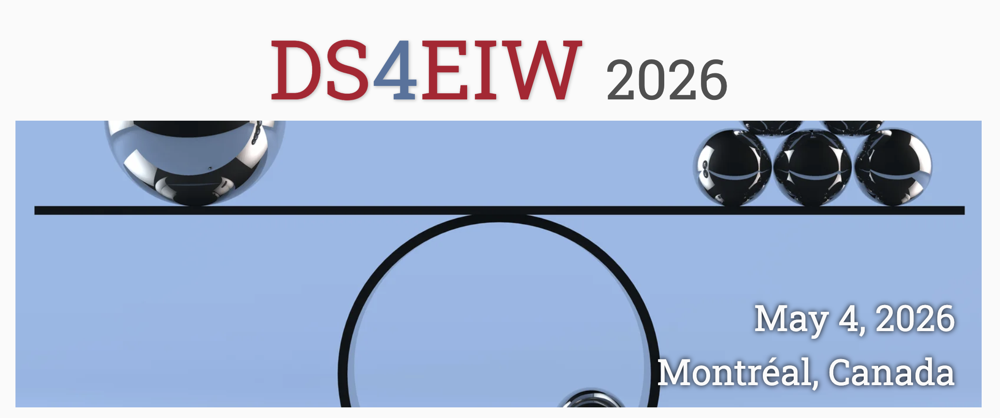

This repository contains the website for the 5th Workshop on Data science for equality, inclusion and well-being challenges (DS4EIW 2026).

The workshop will be held in <b>online</b> format, in conjunction with the <a href="https://icde2026.github.io/">IEEE International Conference on Data Engineering (ICDE) 2026</a> conference in Montréal, Canada, on May 4, 2026.

---

The website follows the [conference-website-template](https://github.com/mikepierce/conference-website-template) by [Mike Pierce](https://github.com/mikepierce).