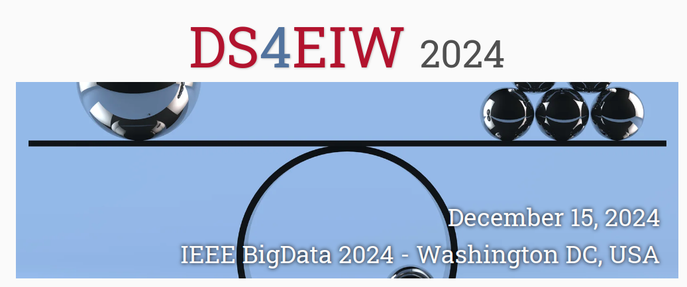

This repository contains the website for the 4th Workshop on Data science for equality, inclusion and well-being challenges (DS4EIW 2024).

The workshop will be held in conjunction with the IEEE International Conference on Big Data (IEEE BigData 2024) in Washington, DC, USA.

---

The website follows the [conference-website-template](https://github.com/mikepierce/conference-website-template) by [Mike Pierce](https://github.com/mikepierce).